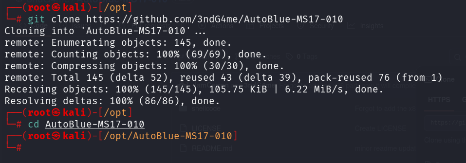
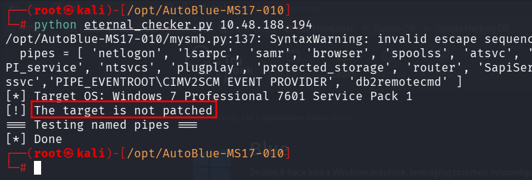
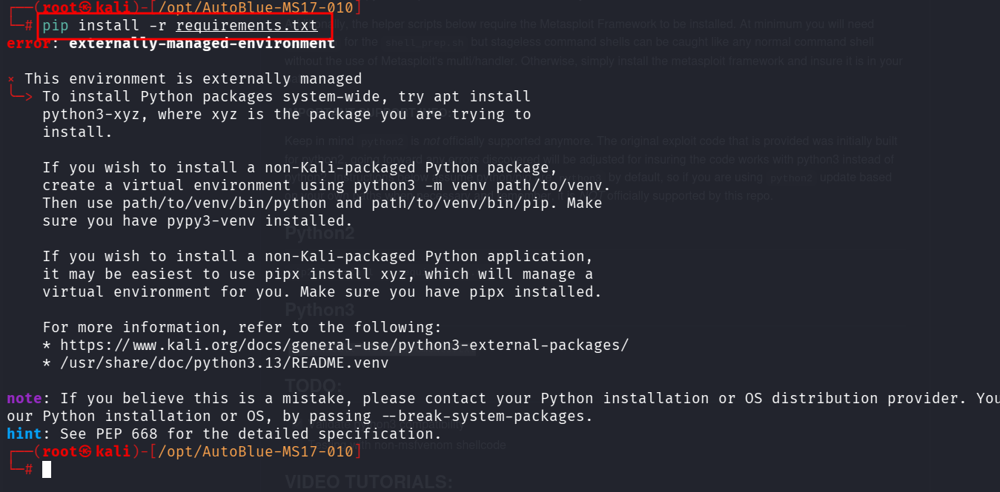
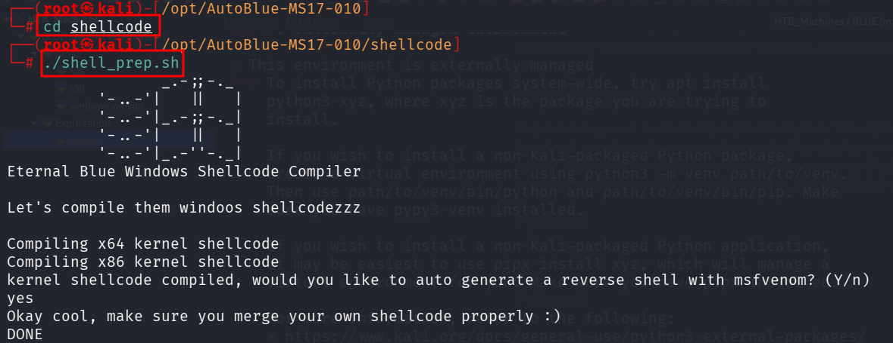
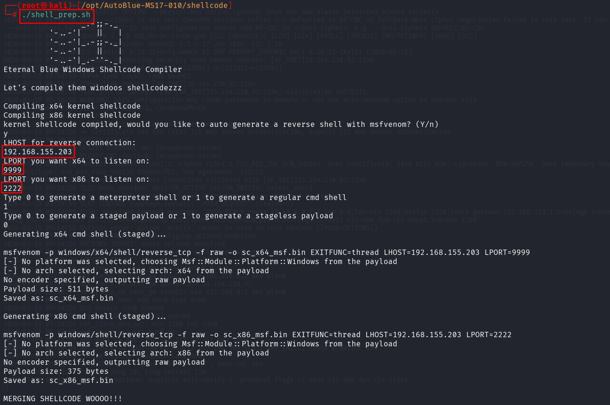
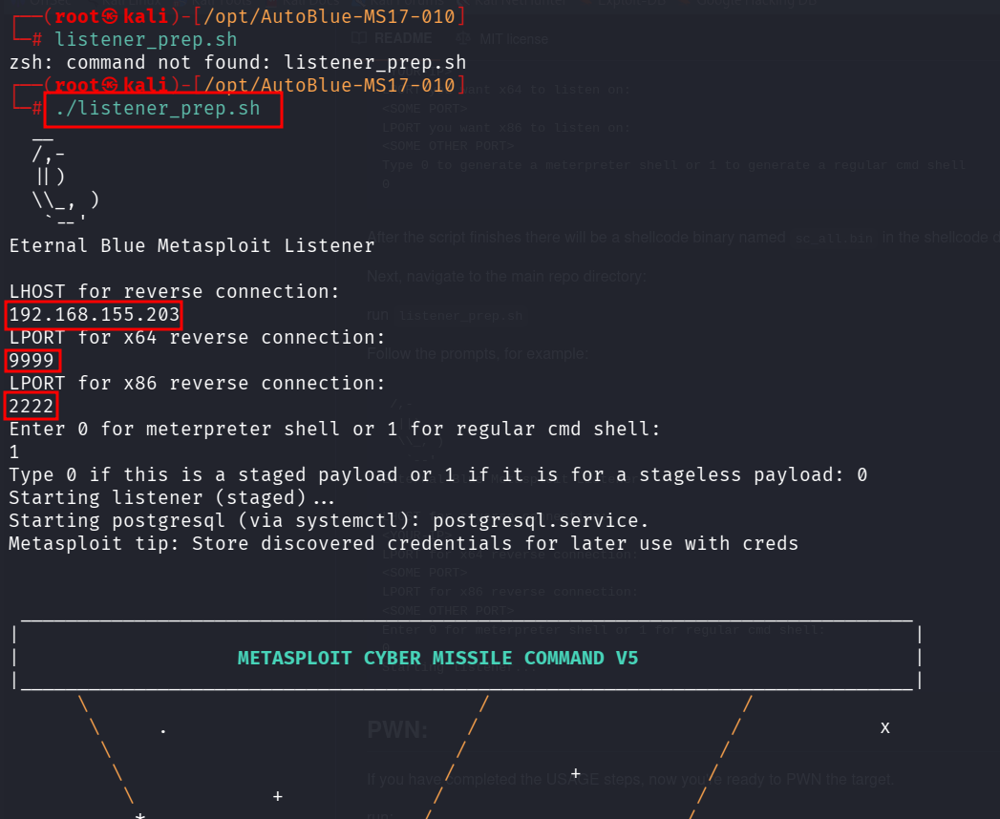
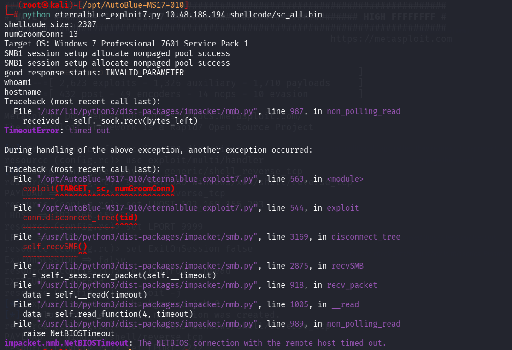
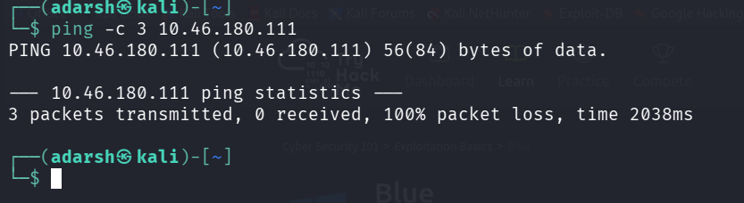

::: page
# manual {#manual .title}

\

Searched for eternal blue github and got a decent repo:
<https://github.com/3ndG4me/AutoBlue-MS17-010>

Cloned this into /opt :

Followed the instructions :

Then installed requirements :

Now, cd to shellcode and run shellprep :

Now follow the other comands :

After that followed other steps :

Ran the final instruction but unfortunately couldnt root :

So the machine actually crashed (we tried it multiple times)

:::
