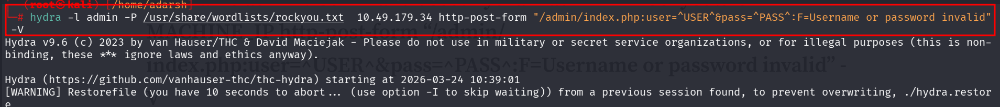
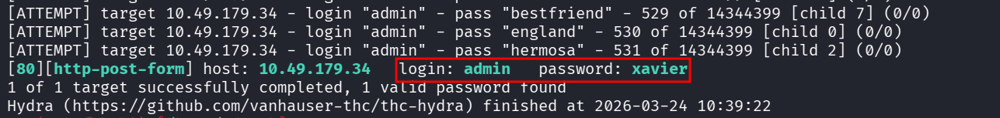
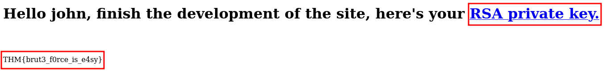
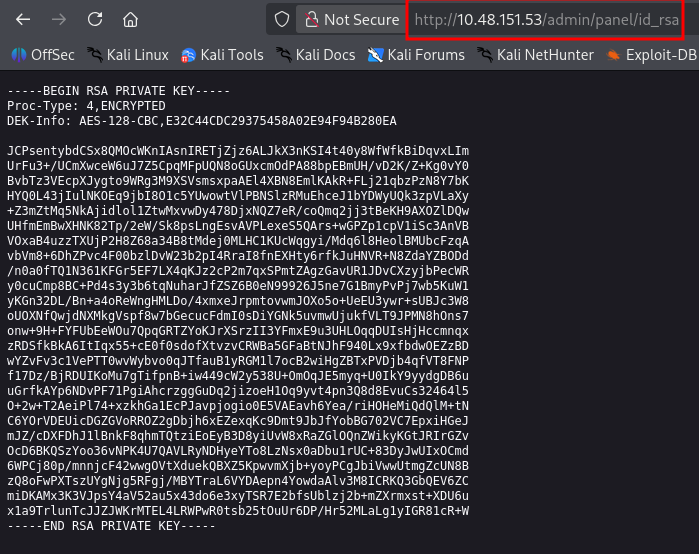
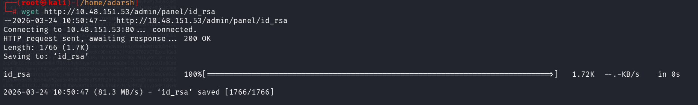
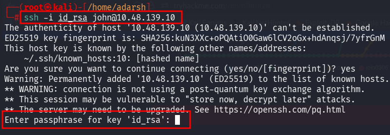
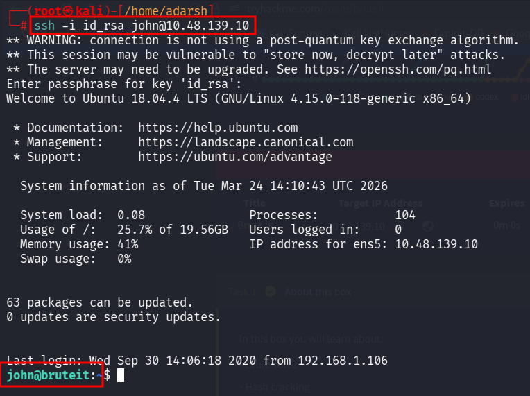

::: page
# bruteforce {#bruteforce .title}

\

Used this command :

**Got a password :**

Used this credentials :

We **transferred this RSA_PRIVATE_KEY to the kali** machine using :

Then on kali :

Now, we **tried to login using id_rsa on ssh** :

The **id_rsa file is passphrase protected and we need to crack that
passphrase.**

To do this we first **convert this id_rsa (.pem file) to a text file or
hash file** using :

**/usr/share/john/ssh2john.py id_rsa \> id_rsa.txt**

After this we **got the id_rsa.txt file and now we will use john to
crack the passphrase.**

**john \--wordlist=/usr/share/wordlists/rockyou.txt id_rsa.txt**

We got the passphrase : **rockinroll**

We redid the ssh login :

Got a **low level user**.
:::
