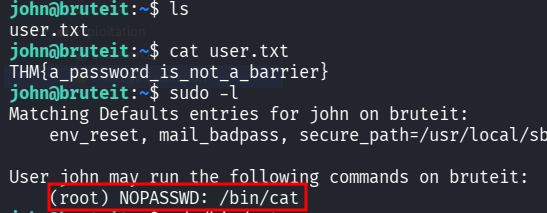
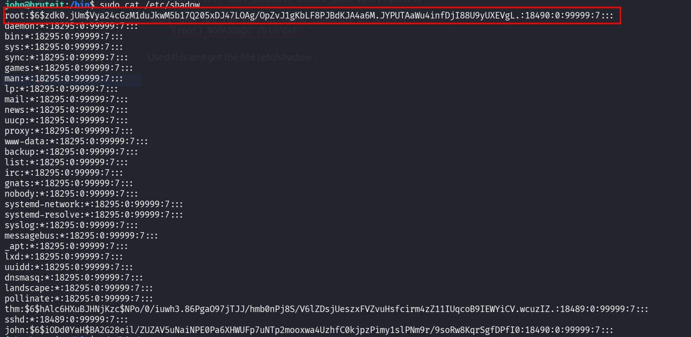
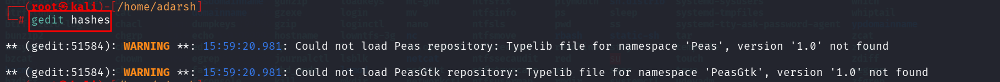
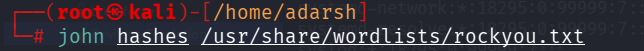
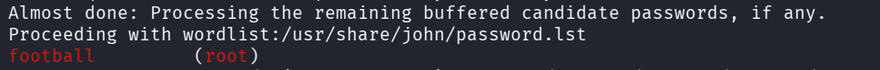

::: page
# Privilege Escalation {#privilege-escalation .title}

\

Used **sudo -l** to see if we have any permissions and saw this :

Used this and got the file **/etc/shadow** :

**Copied this into our kali machine using gedit** :

Used **john to crack the hash** :

Got this :

**We are root!!**
:::
