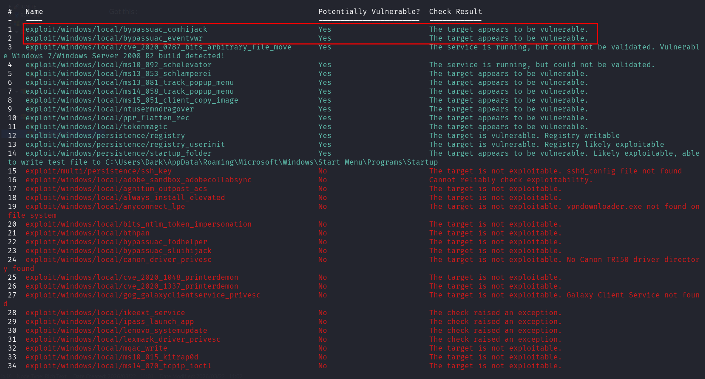
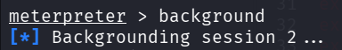
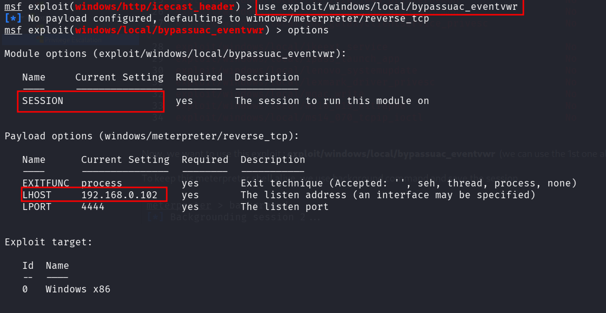
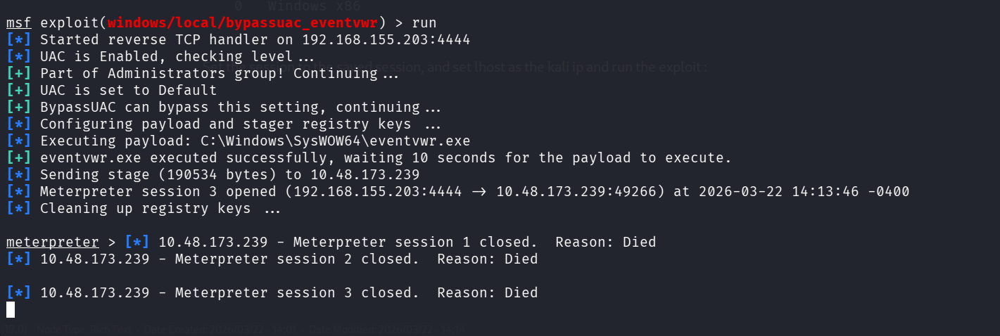
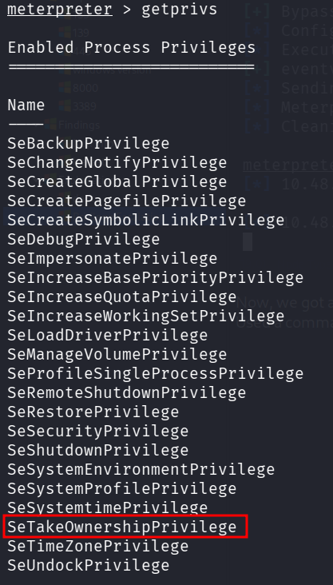
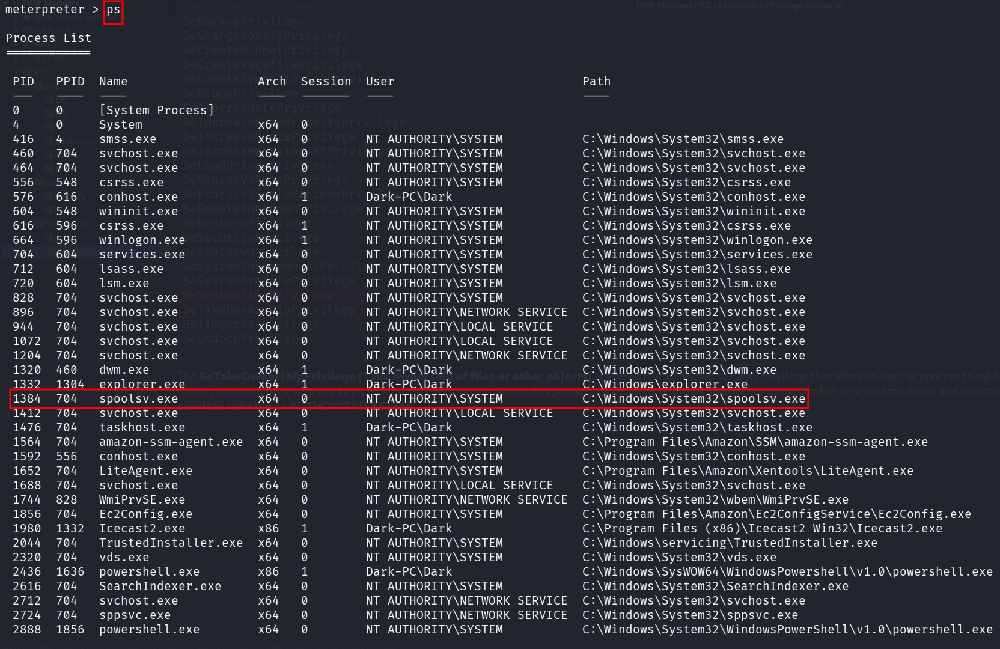
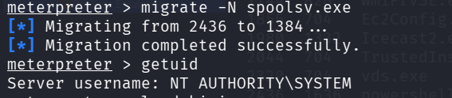

::: page
# Privilege Escalation {#privilege-escalation .title}

\

Found this command to search for local exploits inside the meterpreter
shell : **run post/multi/recon/local_exploit_suggester**

Got this :

Now, we want to use this exploit :
**exploit/windows/local/bypassuac_eventvwr** (we can use the 1st one
also)

To keep this meterpreter shell alive, we use background command and save
the session.

Now, we use the exploit :

Set the session to the saved session, and set lhost as the kali ip and
run the exploit :

Now, we got a meterpreter shell and will recon more to see what services
are running on the user dark.

Used a command called getprivs to get the user privilege :

The **SeTakeOwnershipPrivilege (Take ownership of files or other
objects)** is a powerful Windows security privilege that allows a user
or process to take ownership of any securable

object, including files, registry keys, processes, and services. When
this privilege is enabled, it allows an attacker to bypass file access
restrictions and elevate privileges, often targeting

**services running as AUTHORITY/SYSTEM**

So now, we looked for all the processess that are running on the user
using the command : **ps**

In this case we used a service called spoolsv.exe and elevated our
privilege :

**\[Why did we use spoolsv.exe : We used this specific service because
it almost always runs by default, making it a predictable target.If we
accidentally crash a critical**

**process like**

**lsass.exe or services.exe during migration, the entire operating
system will blue screen or force a reboot, killing the session, whereas
print spooler restarts automatically**

**with crashing the OS. \]**

Now, we are **NT AUTHORITY\\SYSTEM**.
:::
