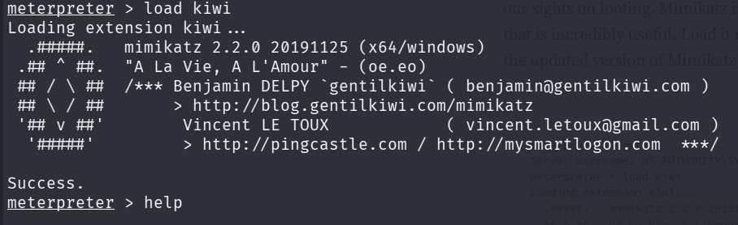
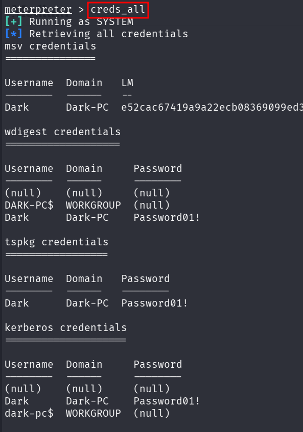
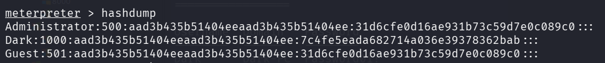
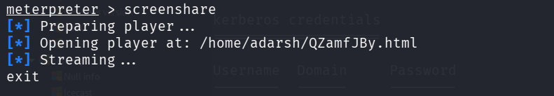
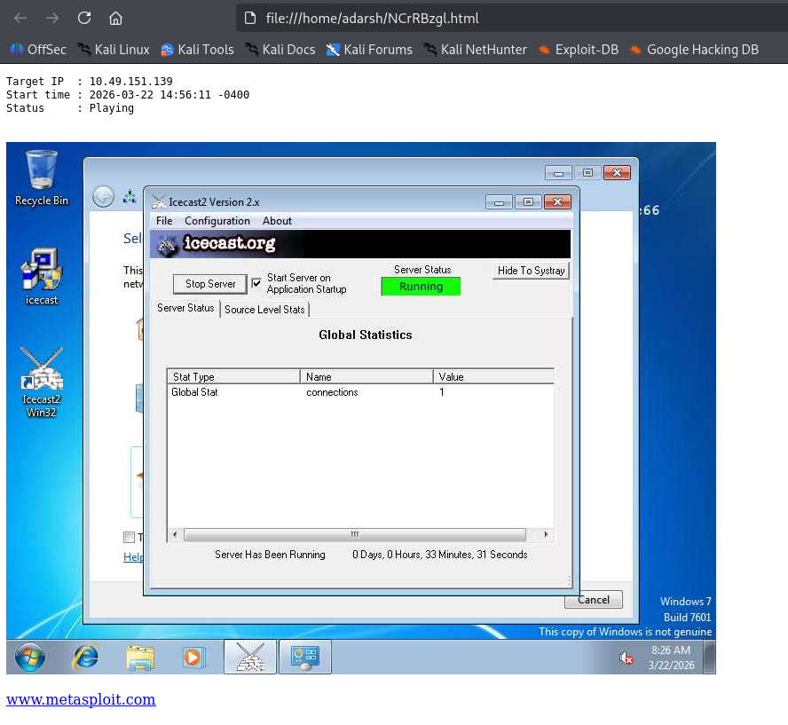

::: page
# KIWI {#kiwi .title}

\

Now that we've made our way to full administrator permissions we'll set
our sights on looting. **Mimikatz** is a rather infamous password
dumping tool that is incredibly useful. Load it

now using the command \`l**oad kiwi**\` (**Kiwi is the updated version
of Mimikatz**).

Now, after \`help\` we got a very long list of things we could do
referring to \`looting\` the system.

Following is the list of things we did :

Credentials :

Hashdump :

Screenshare :

:::
