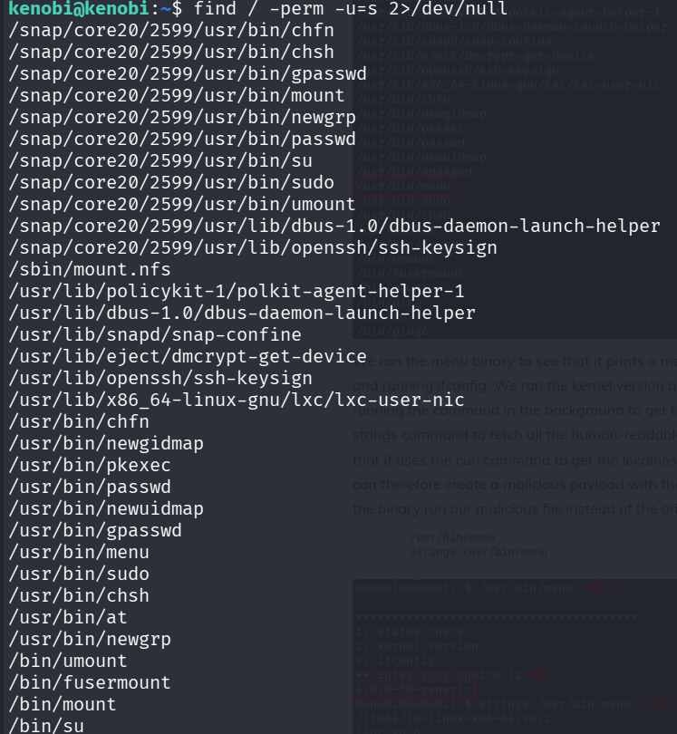
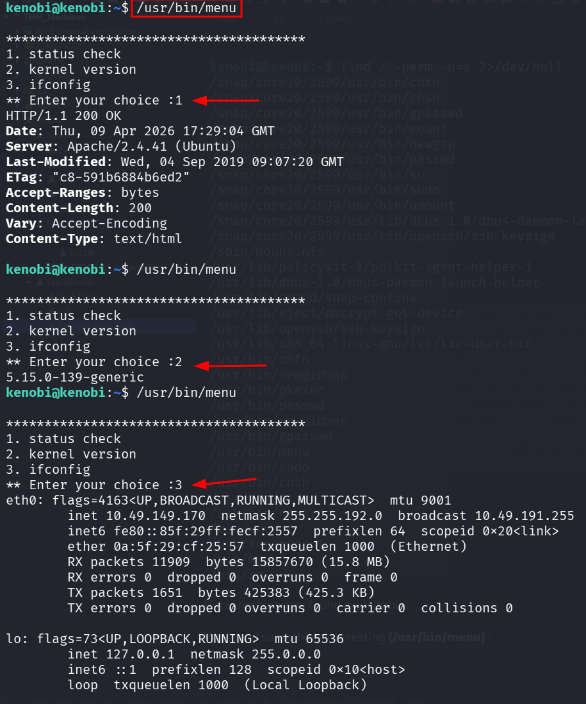
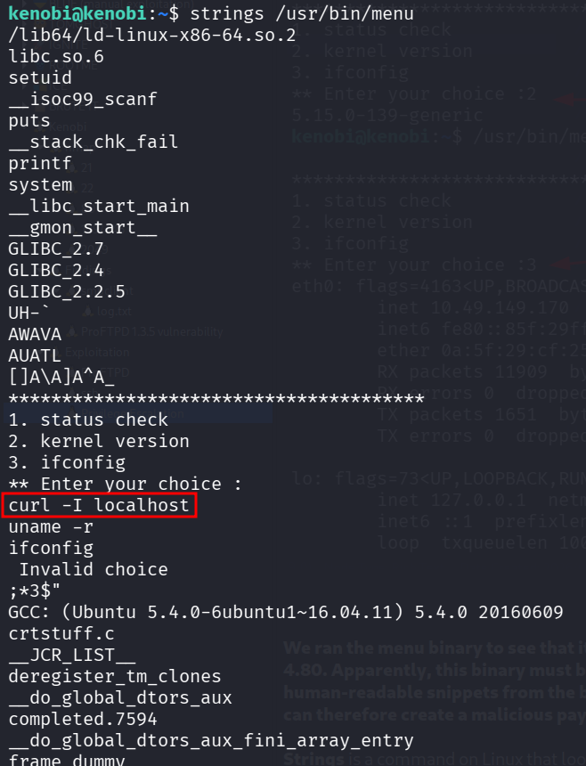
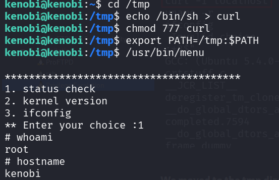

::: page
# Privilege Escalation {#privilege-escalation .title}

\

Found this :

Here, nothing was found exploitable.

We found something interesting **(/usr/bin/menu)** :

**We ran the menu binary to see that it prints a menu with options such
as status check, kernel version, and running ifconfig. We ran the kernel
version and got version**

**4.80. Apparently, this binary must be running the command in the
background to get these outputs. To understand better, we used the
strings command to fetch all the**

**human-readable snippets from the binary, and eventually, we found that
it uses the curl command to get the localhost. Since it doesnt mention
the full path of curl, we**

**can therefore create a malicious payload with the name curl and add it
into the path. This will make the binary run our malicious file instead
of the original curl.**

**Strings** is a command on Linux that looks for **human readable
strings** on a binary.

**We moved to the tmp directory and created a binary invoking the
/bin/sh and named it to curl. Then we changed the permission of the
binary to be executable. At last, we**

**added this curl into the local path using the export command. Now
running the menu binary, we choose an option from the menu and we got
ourselves the root shell.**

:::
