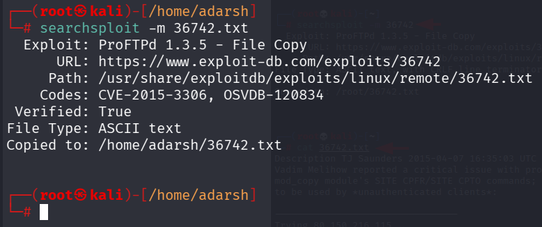
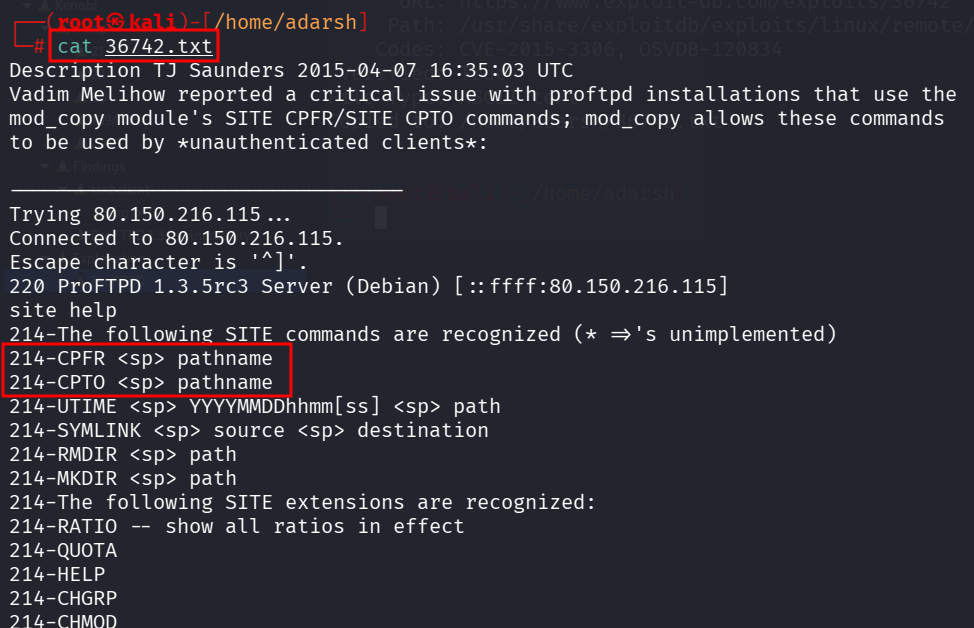
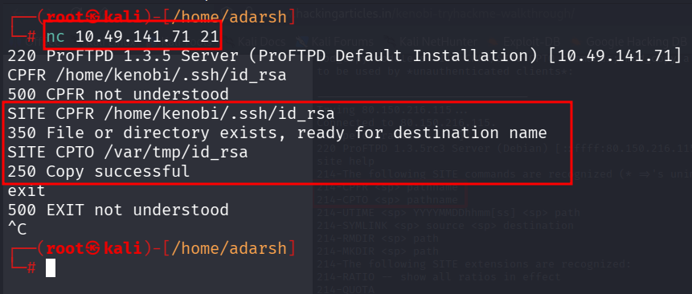
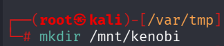
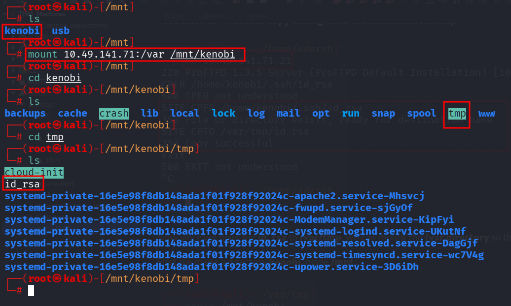

::: page
# ProFTPD {#proftpd .title}

\

Downloaded the exploit :

Now, we catted out the exploit and saw that we can do these 2 commands :

**CPFR (copy from) and CPTO (copy to)**.

Used these commands to **copy the id_rsa to the machines /var/tmp** :

Now since we have the **id_rsa** to **/var/tmp**, we can mount the
**/var directory** so that we can **transfer the id_rsa to our local
machine**.

First we made a directory **kenobi** inside **/mnt** :

Then :

We have the **id_rsa now!!!**
:::
