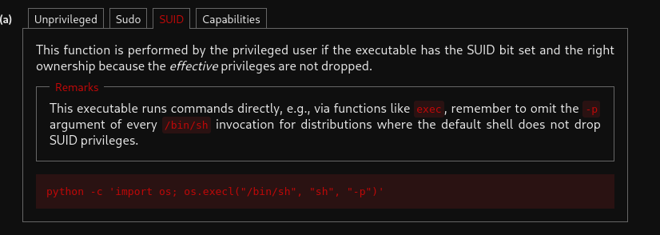
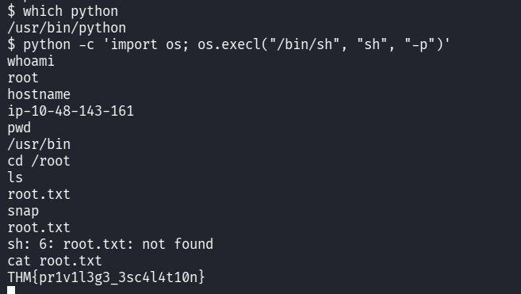

::: page
# Privilege Excalation {#privilege-excalation .title}

\

Now, we didnt have **sudo permissions** enabled for the user.

We hosted the **transfers folder** and used wget to get **linpeas.sh**
into the low level user.

Ran linpeas.sh and found an interesting **suid permisssion** enabled for
**/usr/bin/python**

So then went to **GTFObins and searched for suid \> python** and got the
command :

**python -c \'import os; os.execl(\"/bin/sh\", \"sh\", \"-p\")\'**

Used this command in the low level user and got **root** :

:::
