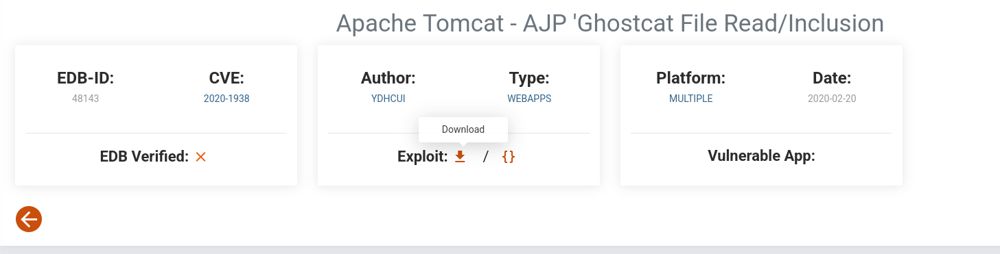
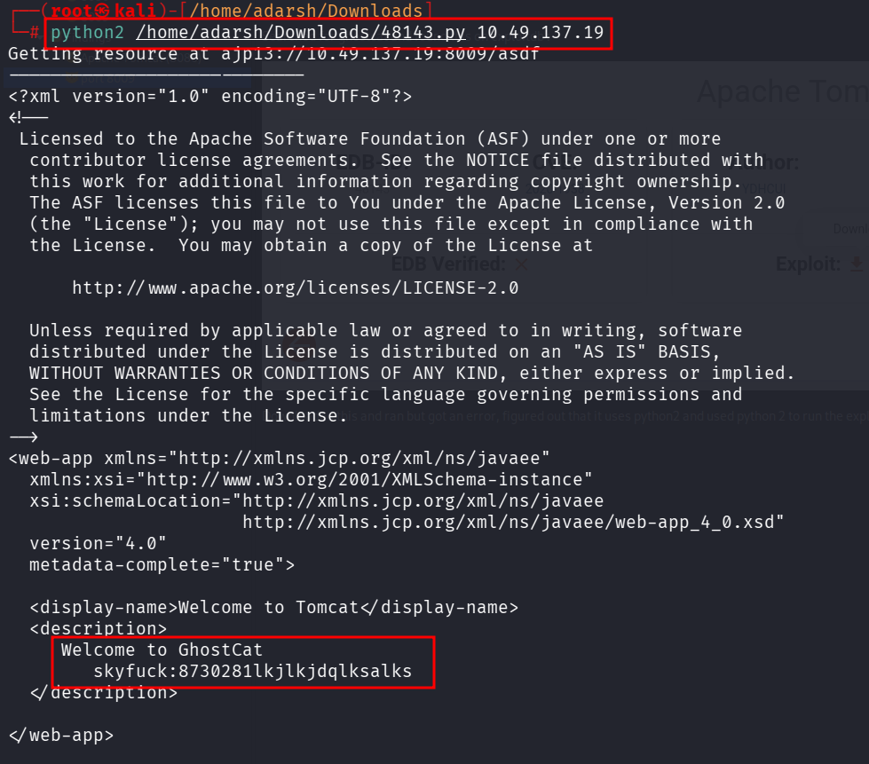
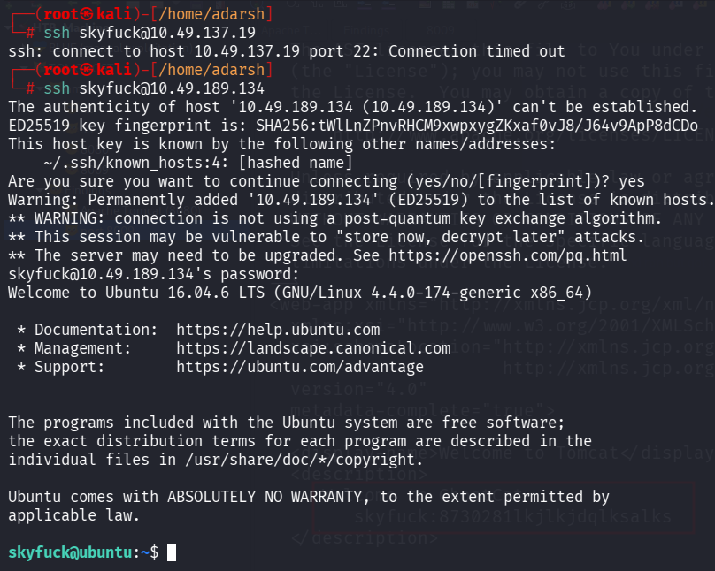

::: page
# Low level user (8009) {#low-level-user-8009 .title}

\

Searched for ghostcat and found this on exploitdb :

Downloaded this and ran but got an error, figured out that it uses
**python2 and used python 2** to run the exploit:

Got this credential for skyfuck.

Found that **this user doesnt have sudo permisssions.**
:::
